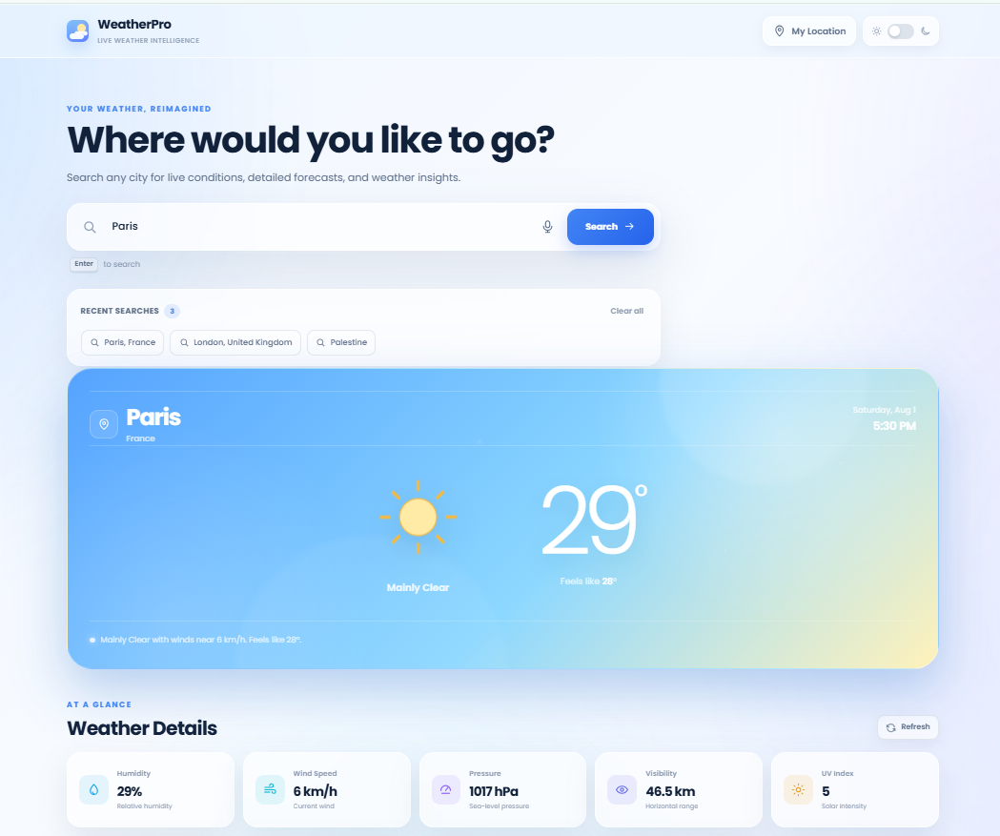
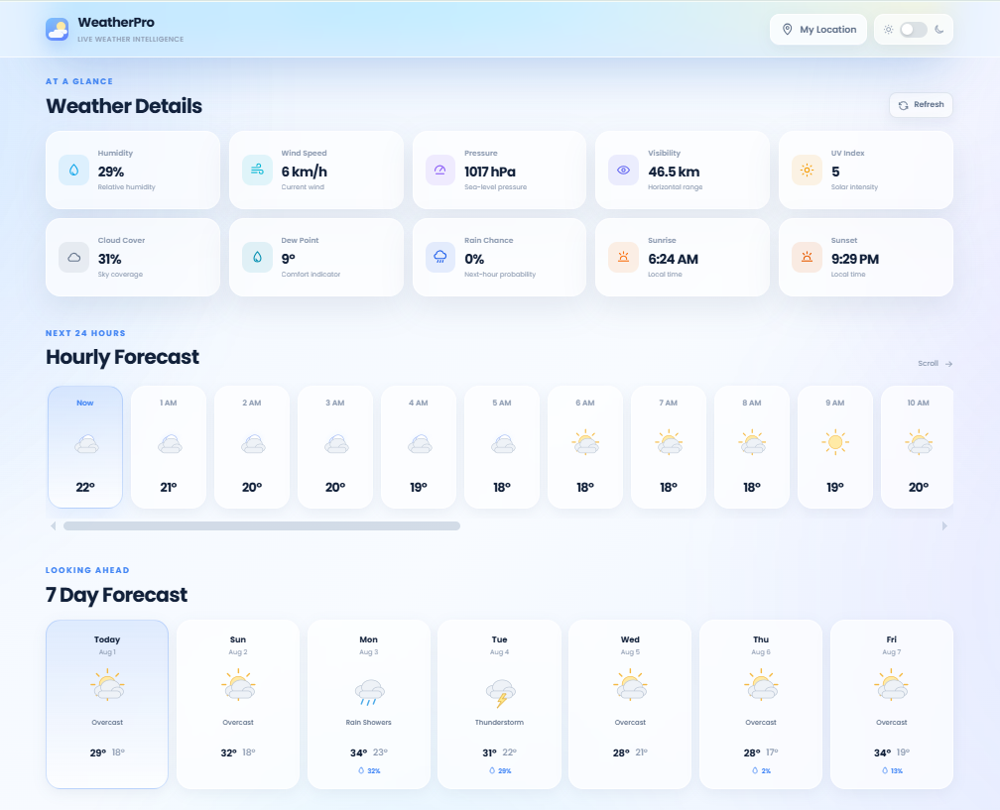
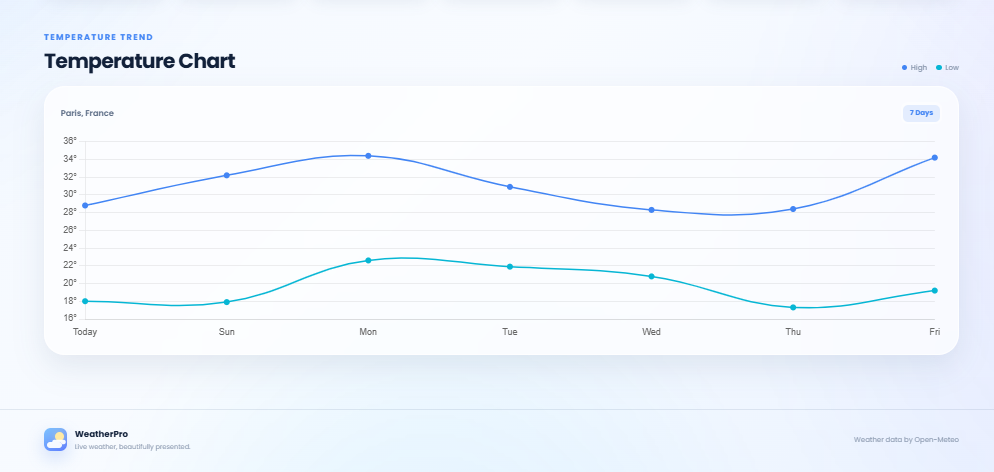
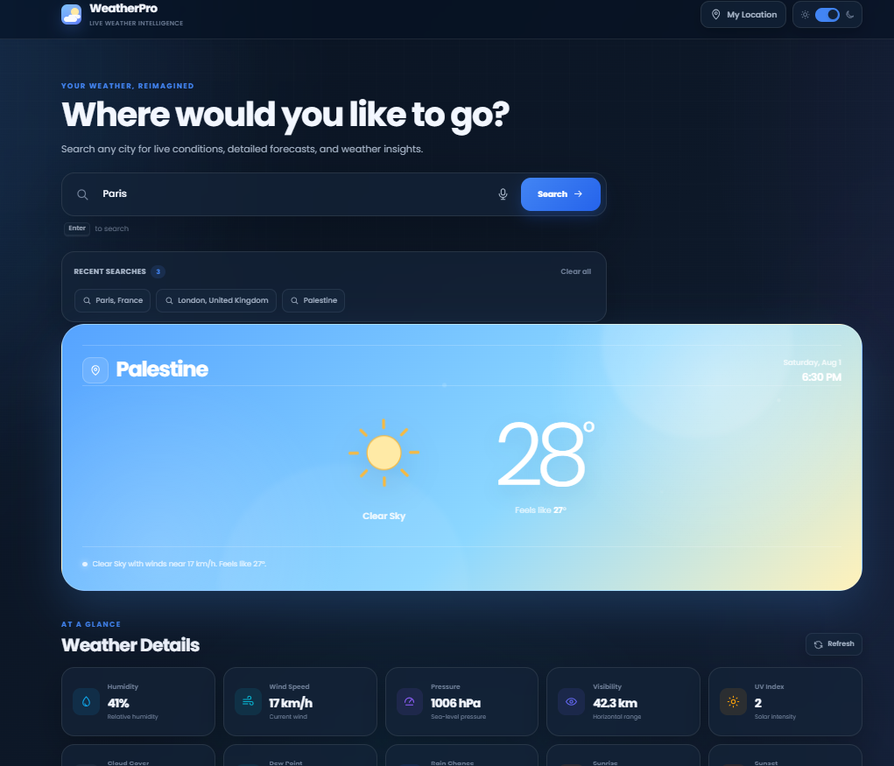
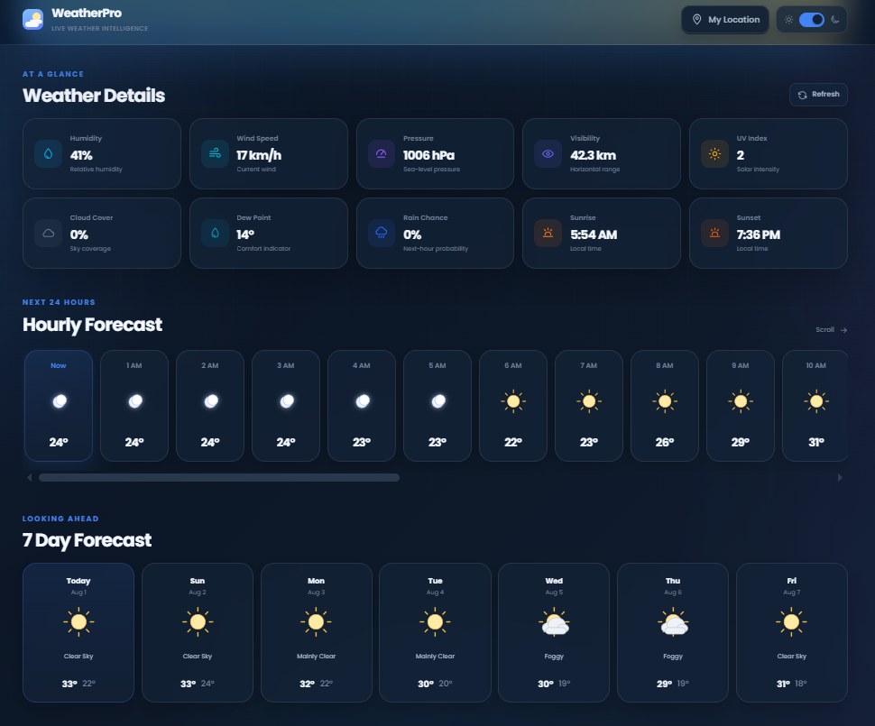

# 🌤️ Modern Weather Dashboard

A modern, responsive, and feature-rich Weather Dashboard built with **HTML5**, **CSS3**, and **JavaScript**, powered by the **Open-Meteo APIs**.

Real-time weather • Hourly & 7-Day Forecasts • Geolocation • Voice Search • Dynamic UI • Interactive Charts

---

## 📖 Overview

Modern Weather Dashboard is a responsive web application that delivers accurate real-time weather information through a clean, intuitive, and interactive user interface.

The application integrates the **Open-Meteo Weather** and **Geocoding APIs** to provide current weather conditions, hourly forecasts, and weekly forecasts while offering a smooth user experience across desktop, tablet, and mobile devices.

This project was built to strengthen frontend development skills by applying real-world concepts such as API integration, asynchronous programming, browser APIs, responsive design, and modern UI development.

---

# ✨ Features

### 🌍 Weather Information
- Real-time weather updates
- Current temperature
- Feels like temperature
- Weather conditions
- Humidity
- Wind Speed
- Atmospheric Pressure
- Visibility
- UV Index
- Cloud Cover
- Dew Point
- Sunrise & Sunset

---

### 📅 Forecasts

- 24-Hour Weather Forecast
- 7-Day Weather Forecast
- Interactive Temperature Chart
- Dynamic Weather Icons

---

### 🔍 Smart Search

- Search weather by city
- Voice Search
- Current Location Weather
- Search History
- Favorite Cities

---

### 🎨 User Experience

- Responsive Design
- Light & Dark Mode
- Dynamic Weather Backgrounds
- Smooth Animations
- Loading Screens
- Toast Notifications
- Error Handling

---

## 🛠️ Built With

| Technology | Purpose |
|------------|----------|
| HTML5 | Structure |
| CSS3 | Styling & Responsive Design |
| JavaScript | Application Logic |
| Fetch API | API Requests |
| Open-Meteo Weather API | Weather Data |
| Open-Meteo Geocoding API | City Search |
| Chart.js | Temperature Charts |
| Local Storage | Geolocation API | Current Location Weather |

---
# 📸 Screenshots

## Light Mode

## Dark Mode

---
# Author

**Abdul Haseeb Younas**

**LinkedIn:** https://www.linkedin.com/in/abdul-haseeb-b188043b6/

# ⭐ Support

If you found this project useful, consider giving it a **⭐ Star** on GitHub.

It helps support my work and motivates me to build more projects.

---

